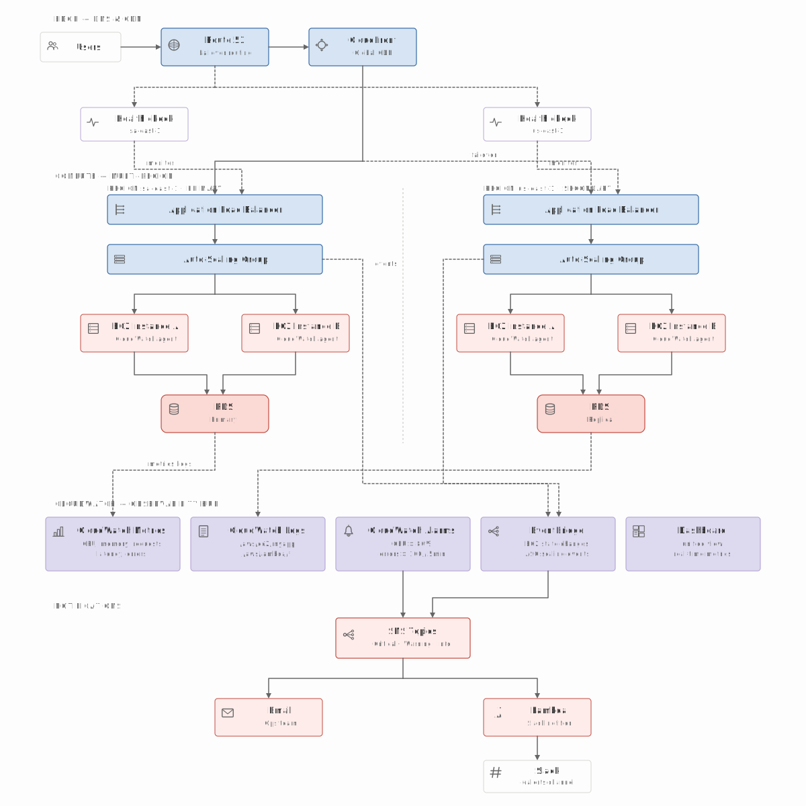
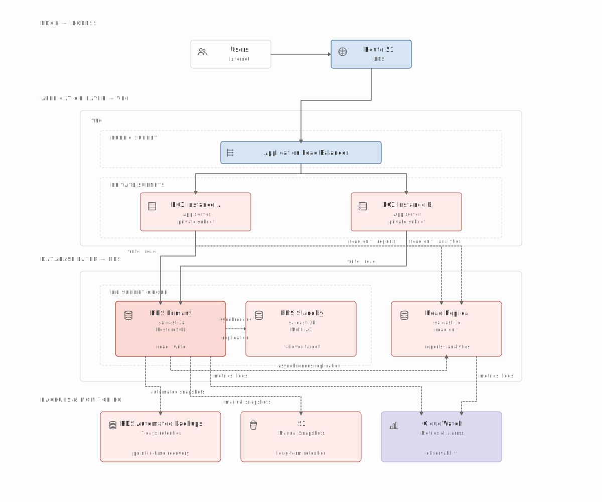

<h1 align="center">Distill Design System</h1>


<p align="center">
  <a href="https://github.com/geo-mena/distill/actions/workflows/release.yml?query=branch%3Amain"></a>
  <a href="https://github.com/geo-mena/distill/releases"></a>
  <a href="LICENSE"></a>
</p>

A Claude Skill that codifies the visual and editorial conventions of [Distill.pub](https://distill.pub), the now-archived web-native ML research journal.

The system targets the modern article template. Tokens, component sizes, link styling, and stroke palette were validated against live `distill.pub` via a 10-article DOM audit. The earlier outlier — Georgia serif body, custom `<dt-article>` element — is out of scope.

## Capabilities

Coverage spans the full Distill corpus — 10 articles, 131 source figures audited and distilled into reusable primitives.

| Category | Prompt | Output |
|---|---|---|
| Editorial in Distill voice | *"Write a long-form on [topic] in Distill style"* | Article with TOC, hover citations, math, 7-section canonical footer |
| Editorial in Distill voice | *"Rewrite this paragraph in Distill voice"* | First-person plural, no marketing superlatives, no exclamation points, math-verbs verbed |
| Diagrams — core | *"Diagram an attention mechanism over memory"* | Composed primitives: `TensorVector`, `Arrow`, `OperatorNode`, `SubNetBlock`, `PointerGlyph`, on the salmon/blue/lavender palette |
| Diagrams — FiLM | *"Visualize this model FiLM-style"* | Pre-built scenes — concat, bias, scaling, FiLM-network, interactive scrubber |
| Diagrams — RL | *"Show a cliffworld with the optimal policy and value function"* | `GridWorld` for cells, paths, agents, goal and penalty cells; `ValueHeatmap` for opacity-encoded V(s) and Q(s,a); `PolicyArrows` for 4-direction stochastic policy |
| Diagrams — graphs and trees | *"Beam search lattice for CTC"* / *"Argumentation tree"* | `GraphNode`, `GraphEdge`; `BeamSearchTree` with active, pruned and neutral states; `DebateTree` with claim and counter sides; `HMMState` with subscript labels |
| Diagrams — sequence and attention | *"Attention heatmap over tokens"* / *"CTC alignment matrix"* | `AttentionHeatmap` — 1D, opacity-modulated; `CellGrid` for CTC DP and Game of Life; `RecurrentArrow` for LSTM/GRU feedback; `VariableTensor` with per-cell width |
| Diagrams — CNN | *"Receptive field with stride 2 padding 1"* | `ConvGrid` — input grid, kernel overlay, padding ring, output cell linkage; output size auto-computed |
| Diagrams — specialized | *"Benzene molecule"* / *"e+ e− → q q̄ Feynman diagram"* / *"Game of Life evolution"* / *"GNN validation accuracy boxplot"* | `MoleculeViewer`, `FeynmanDiagram`, `AutomataGrid`, `DistillBoxplot`, `ImageWithAnnotations` for raster overlays with categorical circles |
| Cloud architecture | *"Multi-region observability diagram"* | Hand-drawn vendor-agnostic SVG using the `service-<slug>` line-art icon library — 29 symbols across edge, compute, data, messaging, observability, networking, storage, identity |
| Slide decks | *"8-slide deck on [paper]"* | Paper-warm background, system sans, one idea per slide, figure breakouts, citations at the foot |
| Product styling | *"Style my dashboard like Distill"* | Drop-in `tokens/colors_and_type.css` tokens; TSX components copy-paste-ready |
| Product styling | *"Convert this brand to a scholarly-editorial system"* | Brand-to-token mapping with diagram primitives |
| Mockups | *"Quick mockup of [feature]"* | Standalone HTML artifact |
| Mockups | *"Lay out 6 variants side-by-side"* | Uses [templates/design-canvas.tsx](plugins/distill-design/templates/design-canvas.tsx) — pan, zoom, drag-reorder, focus mode |
| Mockups | *"Add a live tweaks panel for primary color and font size"* | Uses [templates/tweaks-panel.tsx](plugins/distill-design/templates/tweaks-panel.tsx) — floating panel, postMessage-persisted |
| Visual reference | *"Show me how Distill diagrams [concept]"* | 131 source figures from 10 articles in [sources/](plugins/distill-design/sources/) |

## Examples

Reference architecture diagrams in the system's visual language — vendor-agnostic, hand-drawn line art, paper-warm palette, dashed arrows for failover, replication, and observability.

### Multi-region observability



### Multi-tier app with RDS



## Install

### Claude Code marketplace

```bash
/plugin marketplace add geo-mena/distill
/plugin install distill-design@distill-design-marketplace
```

Restart Claude Code. Invoke with `/distill-design`, or describe an editorial or diagrammatic task — the skill activates by description match.

### Claude Code local symlink

```bash
./scripts/install-claude.sh
```

Symlinks `plugins/distill-design/` to `~/.claude/skills/distill-design`. For iteration on the skill itself.

### Other agents

Per-tool adapters under [configs/](configs/): [Codex](configs/codex/AGENTS.md), [Cursor](configs/cursor/distill-design.mdc), [OpenCode](configs/opencode/AGENTS.md), [OpenClaw](configs/openclaw/AGENTS.md), [Pi](configs/pi/AGENTS.md). Each adapter points the target agent to the canonical skill at `plugins/distill-design/`.

## Repository map

```text
.
├── README.md, CHANGELOG.md, LICENSE
├── package.json                            # Pi package metadata
├── .claude-plugin/                         # marketplace.json + plugin.json
├── configs/                                # per-agent adapters
│   ├── codex/AGENTS.md
│   ├── cursor/distill-design.mdc
│   ├── opencode/AGENTS.md
│   ├── openclaw/AGENTS.md
│   └── pi/AGENTS.md
├── scripts/
│   ├── install-claude.sh                   # symlink to ~/.claude/skills/distill-design
│   └── bump-version.sh                     # release helper, sync version across manifests
└── plugins/distill-design/                 # canonical Skill
    ├── SKILL.md                            # manifest, read by Claude on invocation
    ├── DESIGN-SYSTEM.md                    # voice, color, typography, iconography, caveats
    ├── tokens/colors_and_type.css          # three palettes, type scale, spacing, radii, motion
    ├── fonts/                              # Geist Pixel Square, mono only
    ├── assets/                             # pointer-glyph, wordmark, ICONOGRAPHY.md
    ├── ui_kits/article/                    # 7 .tsx files + assembled index.html
    │   ├── Primitives.tsx                  # TensorVector, Arrow, OperatorNode, SubNetBlock, ...
    │   ├── Chrome.tsx                      # ArticleNav, ArticleHeader, TOCDrawer, ArticleFooter
    │   ├── Diagrams.tsx                    # FiLM scenes — concat, bias, scaling, network, scrubber
    │   ├── RL.tsx                          # GridWorld, ValueHeatmap, PolicyArrows
    │   ├── Graph.tsx                       # GraphNode, GraphEdge, BeamSearchTree, DebateTree, HMMState
    │   ├── Heatmap.tsx                     # AttentionHeatmap, CellGrid, RecurrentArrow, VariableTensor, ConvGrid
    │   ├── Specialized.tsx                 # MoleculeViewer, AutomataGrid, FeynmanDiagram, ImageWithAnnotations, DistillBoxplot
    │   └── index.html                      # serve via HTTP — Babel standalone fetches .tsx via XHR
    ├── templates/                          # author tools
    │   ├── design-canvas.tsx               # Figma-style canvas wrapper
    │   └── tweaks-panel.tsx                # floating live-tweak panel
    ├── preview/                            # 48 reference cards, one per token or component
    ├── sources/                            # 131 source figures from 10 articles
    └── resources/diagrams/                 # output diagrams + _service-icons.svg (29 symbols)
```

## Out of scope

- Emoji.
- Marketing superlatives — "revolutionary", "powerful", "game-changing".
- Exclamation points in body text.
- Gradients, glassmorphism, fixed or sticky elements in articles.
- Simplification of math notation. Density is part of the identity.
- Multi-color or filled icons.
- Earlier Distill template, predating the current `<d-article>` reader.
