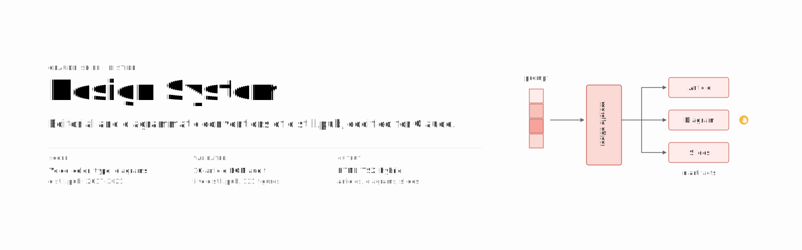

# Distill Design System



A Claude Skill that codifies the visual and editorial conventions of [Distill.pub](https://distill.pub), the now-archived web-native ML research journal.

The system targets the modern article template, in use 2017–2021. Tokens, component sizes, link styling, and stroke palette were validated against live `distill.pub` via a 10-article DOM audit. The 2016 outlier — Georgia serif body, custom `<dt-article>` element — is out of scope.

## Capabilities

Coverage spans the full Distill corpus (10 articles, 131 source figures audited and distilled into reusable primitives).

| Category | Prompt | Output |
|---|---|---|
| Editorial in Distill voice | *"Write a long-form on [topic] in Distill style"* | Article with TOC, hover citations, math, 7-section canonical footer |
| Editorial in Distill voice | *"Rewrite this paragraph in Distill voice"* | First-person plural, no marketing superlatives, no exclamation points, math-verbs verbed |
| Diagrams (core) | *"Diagram an attention mechanism over memory"* | Composed primitives: `TensorVector`, `Arrow`, `OperatorNode`, `SubNetBlock`, `PointerGlyph`, on the salmon/blue/lavender palette |
| Diagrams (FiLM) | *"Visualize this model FiLM-style"* | Pre-built scenes: concat / bias / scaling / FiLM-network / interactive scrubber |
| Diagrams (RL) | *"Show a cliffworld with the optimal policy and value function"* | `GridWorld` (cells, paths, agents, goal/penalty), `ValueHeatmap` (opacity-encoded V(s)/Q(s,a)), `PolicyArrows` (4-direction stochastic policy) |
| Diagrams (graphs / trees) | *"Beam search lattice for CTC"* / *"Argumentation tree"* | `GraphNode`, `GraphEdge`, `BeamSearchTree` (active/pruned/neutral states), `DebateTree` (claim/counter sides), `HMMState` (subscript-bearing) |
| Diagrams (sequence / attention) | *"Attention heatmap over tokens"* / *"CTC alignment matrix"* | `AttentionHeatmap` (1D opacity-modulated), `CellGrid` (CTC DP / Game of Life), `RecurrentArrow` (LSTM/GRU feedback), `VariableTensor` (per-cell width) |
| Diagrams (CNN) | *"Receptive field with stride 2 padding 1"* | `ConvGrid`: input + kernel overlay + padding ring + output cell linkage, auto-computed output size |
| Diagrams (specialized) | *"Benzene molecule"* / *"e+ e− → q q̄ Feynman diagram"* / *"Game of Life evolution"* / *"GNN validation accuracy boxplot"* | `MoleculeViewer`, `FeynmanDiagram`, `AutomataGrid`, `DistillBoxplot`, `ImageWithAnnotations` (raster + categorical overlay circles) |
| Cloud architecture | *"Multi-region observability diagram"* | Hand-drawn vendor-agnostic SVG using the `service-<slug>` line-art icon library (29 symbols across edge / compute / data / messaging / observability / networking / storage / identity) |
| Slide decks | *"8-slide deck on [paper]"* | Paper-warm background, system sans, one idea per slide, figure breakouts, citations at the foot |
| Product styling | *"Style my dashboard like Distill"* | Drop-in `tokens/colors_and_type.css` tokens, TSX components copy-paste-ready |
| Product styling | *"Convert this brand to a scholarly-editorial system"* | Brand-to-token mapping with diagram primitives |
| Mockups | *"Quick mockup of [feature]"* | Standalone HTML artifact |
| Mockups | *"Lay out 6 variants side-by-side"* | Uses [templates/design-canvas.tsx](plugins/distill-design/templates/design-canvas.tsx): pan/zoom, drag-reorder, focus mode |
| Mockups | *"Add a live tweaks panel for primary color and font size"* | Uses [templates/tweaks-panel.tsx](plugins/distill-design/templates/tweaks-panel.tsx): floating panel, postMessage-persisted |
| Visual reference | *"Show me how Distill diagrams [concept]"* | 131 source figures from 10 articles in [sources/](plugins/distill-design/sources/) |

## Install

### Claude Code (plugin)

```bash
/plugin marketplace add geo-mena/distill
/plugin install distill-design@distill-design-marketplace
```

Restart Claude Code. Invoke with `/distill-design`, or describe an editorial or diagrammatic task — the skill activates by description match.

### Claude Code (local symlink)

```bash
./scripts/install-claude.sh
```

Symlinks `plugins/distill-design/` to `~/.claude/skills/distill-design`. Useful when iterating on the skill itself.

### Other agents

Per-tool adapters in [configs/](configs/): [Codex](configs/codex/AGENTS.md), [Cursor](configs/cursor/distill-design.mdc), [OpenCode](configs/opencode/AGENTS.md), [OpenClaw](configs/openclaw/AGENTS.md), [Pi](configs/pi/AGENTS.md). Each one tells the target agent where to find the canonical skill at `plugins/distill-design/`.

## Repository map

| Path | Purpose |
|---|---|
| [plugins/distill-design/SKILL.md](plugins/distill-design/SKILL.md) | Skill manifest, read by Claude on invocation |
| [plugins/distill-design/DESIGN-SYSTEM.md](plugins/distill-design/DESIGN-SYSTEM.md) | Design rules: voice, color, typography, iconography, caveats |
| [plugins/distill-design/tokens/colors_and_type.css](plugins/distill-design/tokens/colors_and_type.css) | CSS variables: 3 palettes, type scale, spacing, radii, shadows, motion |
| [plugins/distill-design/fonts/](plugins/distill-design/fonts/) | Geist Pixel Square (mono only). Body and display use the OS system sans stack |
| [plugins/distill-design/assets/](plugins/distill-design/assets/) | Pointer-glyph SVG, wordmark SVG, [iconography rules](plugins/distill-design/assets/ICONOGRAPHY.md) |
| [plugins/distill-design/ui_kits/article/](plugins/distill-design/ui_kits/article/) | Article reader: Primitives, Chrome, Diagrams (`.tsx`) and assembled `index.html` |
| [plugins/distill-design/templates/](plugins/distill-design/templates/) | Author tools: `design-canvas.tsx`, `tweaks-panel.tsx` |
| [plugins/distill-design/preview/](plugins/distill-design/preview/) | 30 reference cards, one per token or component |
| [plugins/distill-design/sources/](plugins/distill-design/sources/) | 131 source figures from 10 Distill articles |
| [.claude-plugin/](.claude-plugin/) | Plugin manifest and marketplace metadata |
| [configs/](configs/) | Per-agent adapters (Codex, Cursor, OpenCode, OpenClaw, Pi) |
| [scripts/](scripts/) | `install-claude.sh` (Claude Code symlink) and `bump-version.sh` (release helper) |

## Out of scope

- Emoji.
- Marketing superlatives ("revolutionary", "powerful", "game-changing").
- Exclamation points in body text.
- Gradients, glassmorphism, fixed or sticky elements in articles.
- Simplification of math notation. Density is part of the identity.
- Multi-color or filled icons.
- 2016 Distill template.
