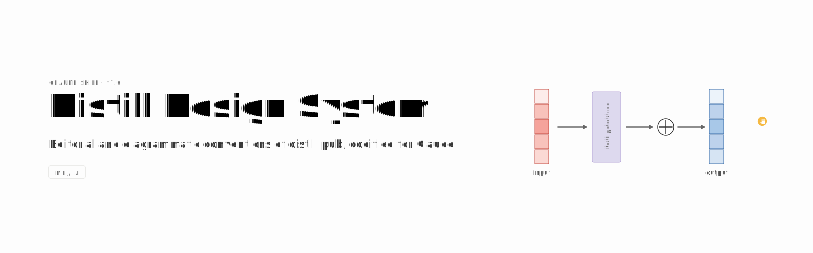

# Distill Design System



A Claude Skill that codifies the visual and editorial conventions of [Distill.pub](https://distill.pub), the now-archived web-native ML research journal.

The system targets the modern article template, in use 2017–2021. Tokens, component sizes, link styling, and stroke palette were validated against live `distill.pub` via a 10-article DOM audit. The 2016 outlier — Georgia serif body, custom `<dt-article>` element — is out of scope.

## Capabilities

| Category | Prompt | Output |
|---|---|---|
| Editorial in Distill voice | *"Write a long-form on [topic] in Distill style"* | Article with TOC, hover citations, math, 7-section canonical footer |
| Editorial in Distill voice | *"Rewrite this paragraph in Distill voice"* | First-person plural, no marketing superlatives, no exclamation points, math-verbs verbed |
| Diagrams | *"Diagram an attention mechanism over memory"* | Composed primitives, `TensorVector`, `Arrow`, `OperatorNode`, `SubNetBlock`, `PointerGlyph`, on the salmon/blue/lavender palette |
| Diagrams | *"Visualize this model FiLM-style"* | Pre-built scenes: concat / bias / scaling / FiLM-network / interactive scrubber |
| Slide decks | *"8-slide deck on [paper]"* | Paper-warm background, system sans, one idea per slide, figure breakouts, citations at the foot |
| Product styling | *"Style my dashboard like Distill"* | Drop-in `colors_and_type.css` tokens, TSX components copy-paste-ready |
| Product styling | *"Convert this brand to a scholarly-editorial system"* | Brand-to-token mapping with diagram primitives |
| Mockups | *"Quick mockup of [feature]"* | Standalone HTML artifact |
| Mockups | *"Lay out 6 variants side-by-side"* | Uses [design-canvas.tsx](design-canvas.tsx): pan/zoom, drag-reorder, focus mode |
| Mockups | *"Add a live tweaks panel for primary color and font size"* | Uses [tweaks-panel.tsx](tweaks-panel.tsx): floating panel, postMessage-persisted |
| Visual reference | *"Show me how Distill diagrams [concept]"* | 131 source figures from 10 articles in [sources/](sources/) |
| Cover banner | *"Generate a README cover for [project name]"* | 1600×500 SVG with system-sans typography stack, mini-equation diagram (`TensorVector` → `SubNetBlock` → `OperatorNode` → `TensorVector` → `PointerGlyph`), saved to [covers/](covers/) |

## Usage modes

### As a Claude Skill

```bash
ln -s "$(pwd)" ~/.claude/skills/distill-design
```

Invoke with `/distill-design` in any Claude Code session, or describe an editorial or diagrammatic task; the skill activates by description match.

### As a reference for porting

| What | Where |
|---|---|
| CSS variables | [colors_and_type.css](colors_and_type.css) |
| TSX components with prop interfaces | [ui_kits/article/](ui_kits/article/) |
| Per-token reference cards (30) | [preview/](preview/) |
| Source figures (131) | [sources/](sources/) |
| Voice, color, typography, iconography rules | [DESIGN-SYSTEM.md](DESIGN-SYSTEM.md) |

<!-- ### As a live demo

```bash
python3 -m http.server 8765
```

Open [http://localhost:8765/ui_kits/article/index.html](http://localhost:8765/ui_kits/article/index.html). The article kit requires HTTP. Babel standalone fetches the `.tsx` files via XHR, and Chromium blocks XHR over `file://` under CORS. See [ui_kits/article/README.md](ui_kits/article/README.md). -->

## Repository map

| Path | Purpose |
|---|---|
| [SKILL.md](SKILL.md) | Skill manifest, read by Claude on invocation |
| [DESIGN-SYSTEM.md](DESIGN-SYSTEM.md) | Design rules: voice, color, typography, iconography, caveats |
| [colors_and_type.css](colors_and_type.css) | CSS variables: 3 palettes, type scale, spacing, radii, shadows, motion |
| [fonts/](fonts/) | Geist Pixel Square (mono only). Body and display use the OS system sans stack |
| [assets/](assets/) | Pointer-glyph SVG, wordmark SVG, [iconography rules](assets/ICONOGRAPHY.md) |
| [ui_kits/article/](ui_kits/article/) | Article reader: Primitives, Chrome, Diagrams (`.tsx`) and assembled `index.html` |
| [design-canvas.tsx](design-canvas.tsx) | Author tool: Figma-style canvas wrapper |
| [tweaks-panel.tsx](tweaks-panel.tsx) | Author tool: floating live-tweak panel |
| [preview/](preview/) | 30 reference cards, one per token or component |
| [sources/](sources/) | 131 source figures from 10 Distill articles |
| [covers/](covers/) | Generated GitHub cover banners. See [covers/distill-design-system.svg](covers/distill-design-system.svg) as canonical example |
| [tsconfig.json](tsconfig.json), [globals.d.ts](globals.d.ts) | TypeScript config and ambient types. No `node_modules` |

## Out of scope

- Emoji.
- Marketing superlatives ("revolutionary", "powerful", "game-changing").
- Exclamation points in body text.
- Gradients, glassmorphism, fixed or sticky elements in articles.
- Simplification of math notation. Density is part of the identity.
- Multi-color or filled icons.
- 2016 Distill template.
